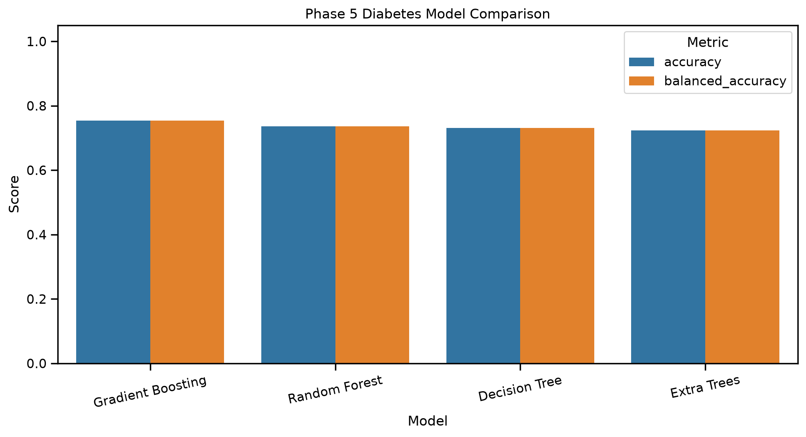
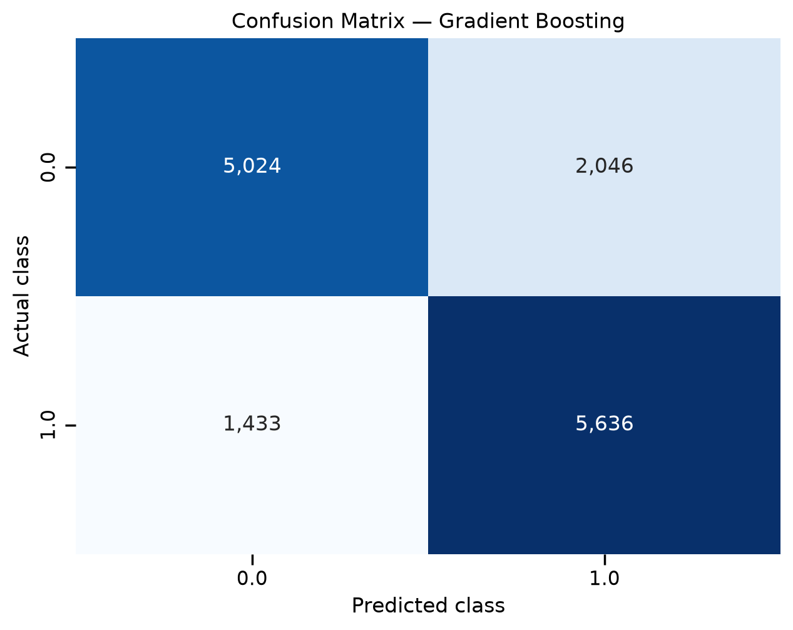
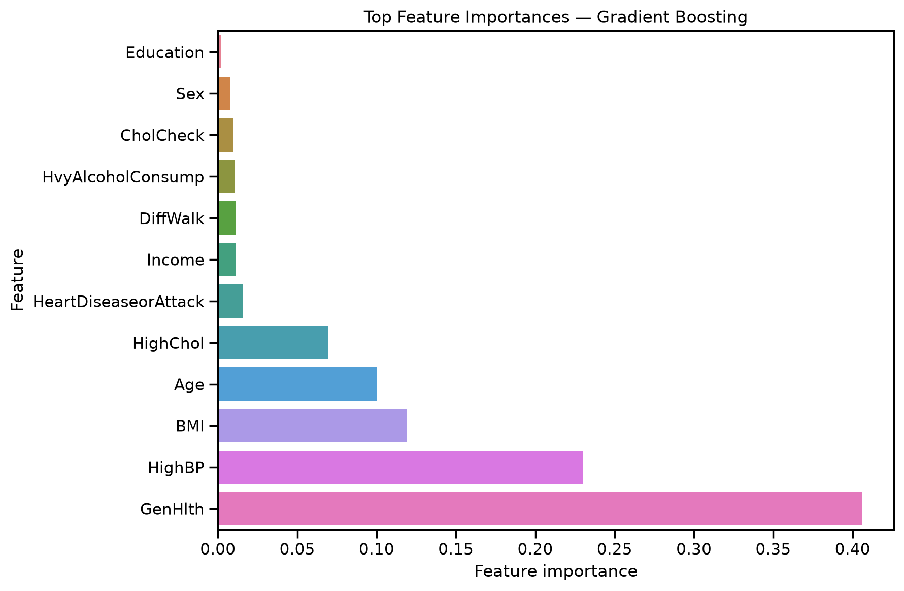

# Ensemble Models Project

This site documents my Module 5 ensemble-modeling project. The work includes a
small technical modification to the provided Penguins example and a custom
diabetes-classification project.

- **Author:** Abdellah Boudlal
- **GitHub repository:** [Aboudlal/ml-05-ensembles](https://github.com/Aboudlal/ml-05-ensembles)
- **Phase 4 notebook:** [ml_05_abdellah.ipynb](https://github.com/Aboudlal/ml-05-ensembles/blob/main/notebooks/ml_05_diabetes_abdellah.ipynb)
- **Phase 5 notebook:** [ml_05_diabetes_abdellah.ipynb](https://github.com/Aboudlal/ml-05-ensembles/blob/main/notebooks/ml_05_diabetes_abdellah.ipynb)

## How-To Guide

Many instructions are common to all course projects.

See
[⭐ Workflow: Apply Example](https://denisecase.github.io/pro-analytics-02/workflow-b-apply-example-project/)
for the standard process used to set up, run, modify, document, and publish the
project.

## Project Documentation Pages

- **Home** — this project landing page
- [**Project Instructions**](./project-instructions.md) — the standard workflow
- [**Your Files**](./your-files.md) — how to copy and rename the example files
- [**Glossary**](./glossary.md) — important ensemble-modeling terms
- [**API**](./api.md) — autogenerated documentation for the project interface

---

## Phase 4. Technical Modification

### What I Changed

I copied the original Penguins ensemble notebook and created my own version,
`notebooks/ml_05_abdellah.ipynb`. The original example compared one single
decision tree with two ensemble models:

- Random Forest
- Gradient Boosting

My technical modification added a third ensemble model,
`ExtraTreesClassifier`. The customized notebook therefore compares four models:

1. Decision Tree
2. Random Forest
3. Gradient Boosting
4. Extra Trees

I also updated the imports, model-training section, accuracy calculations,
results dictionary, comparison chart, logging statements, interpretation, and
summary so that the new model is included throughout the workflow.

### Why I Chose This Change

I chose Extra Trees because it is closely related to Random Forest but applies
more randomization when building the individual trees. This made it a useful
and manageable extension of the original example. It allowed me to make a real
technical change without replacing the full working workflow.

### How I Verified It

I selected the local `.venv` kernel and ran every notebook cell from top to
bottom. I verified that:

- all four models trained without an error;
- an `extra_trees` accuracy appeared in the output;
- the comparison chart displayed four model bars;
- the notebook summary included Extra Trees;
- the results were written to `project.log`;
- the completed notebook was saved before being pushed to GitHub.

### Result

The logged best model was Random Forest with a held-out test accuracy of
`1.000`. The Extra Trees model ran successfully and became part of the model
comparison, but the modification did not produce a higher logged score than
Random Forest for this test split.

This change matters because the notebook now provides a broader ensemble
comparison. It also shows that adding another model does not automatically
produce a meaningful improvement. The analyst must compare performance on
held-out data and decide whether additional complexity is justified.

### Difficulty

I rated this modification as **moderate**. Adding the classifier itself was
straightforward, but I needed to update every connected part of the notebook
carefully. A model should not be added only to the training cell; it must also
be evaluated, charted, logged, interpreted, and documented.

---

## Phase 5. Custom Project

### Project Goal

For the custom project, I applied the same ensemble-modeling workflow to a new
problem: predicting diabetes status from health, demographic, lifestyle, and
healthcare-access indicators.

The completed custom notebook is
[`notebooks/ml_05_diabetes_abdellah.ipynb`](https://github.com/Aboudlal/ml-05-ensembles/blob/main/notebooks/ml_05_diabetes_abdellah.ipynb).

### Basis and Data

The original example used the Seaborn Penguins dataset and predicted the
categorical target `species` from four physical measurements.

My custom project uses:

```text
data/raw/diabetes.csv
```

This file is the balanced binary version of the CDC Diabetes Health Indicators
dataset derived from the 2015 Behavioral Risk Factor Surveillance System
survey. It contains 70,692 rows and 22 columns. The binary target is
`Diabetes_binary`, and the remaining 21 columns are predictors.

I selected this dataset because it provides a larger real-world classification
problem that is appropriate for comparing tree-based ensemble models. The
balanced version also makes ordinary accuracy easier to interpret, although I
still included balanced accuracy and other classification metrics.

Important limitations include the following:

- the data comes from survey responses;
- some variables are self-reported;
- the model finds predictive patterns but does not establish causation;
- performance on one train-test split does not guarantee future performance;
- this educational project must not be used as a medical diagnostic system.

### Modeling Approach

This is a **supervised machine-learning problem** because the dataset includes a
known target label for each instance.

It is a **binary classification problem** because the target represents two
classes. The notebook compares one baseline model and three ensemble models:

- Decision Tree
- Random Forest
- Gradient Boosting
- Extra Trees

The data is divided into stratified training and testing subsets using an
80/20 split. Stratification preserves the target proportions in both subsets.
Every model is trained with the same training data and evaluated with the same
held-out testing data so the comparison is fair.

Tree-based methods are appropriate because the dataset includes many health
indicators with potentially nonlinear relationships and interactions. They
also provide feature-importance values that help explain which predictors the
selected model relied on most.

### Target

In the original Penguins notebook, the target was `species`, a three-class
categorical variable.

In the custom project, the target is:

```text
Diabetes_binary
```

This target represents a binary classification outcome. Changing from a
three-class species target to a two-class diabetes-status target changes the
interpretation and evaluation. In addition to accuracy, the custom project
reports precision, recall, F1 score, balanced accuracy, ROC AUC, and a confusion
matrix.

These additional metrics are important because a classification model can have
a reasonable overall accuracy while still making important errors for one of
the target classes.

### Features

The original example used four numeric Penguin measurements:

- `bill_length_mm`
- `bill_depth_mm`
- `flipper_length_mm`
- `body_mass_g`

The custom project uses all available predictor columns after separating the
target. These include indicators related to:

- blood pressure and cholesterol;
- body mass index;
- smoking and physical activity;
- fruit and vegetable consumption;
- alcohol consumption;
- general, mental, and physical health;
- mobility difficulty;
- sex and age group;
- education and income;
- healthcare access and cost barriers.

The notebook automatically prepares the features, handles nonfinite or missing
values, and encodes categorical predictors if any are present. The original raw
CSV remains unchanged.

### Evaluation and Results

The four models are evaluated on the same held-out test set with:

- accuracy;
- balanced accuracy;
- precision;
- recall;
- F1 score;
- ROC AUC;
- a confusion matrix.

The notebook generates and saves a complete results table here:

[View the exported model results](https://github.com/Aboudlal/ml-05-ensembles/blob/main/data/processed/phase5_model_results.csv)

The main result is a reproducible comparison of the four models under the same
conditions. The notebook automatically ranks the models by held-out accuracy,
using F1 score as a tie-breaker, and identifies the best-performing model in the
final output and `project.log`.

The exact model scores are preserved in the fully executed notebook and the
exported CSV rather than being manually retyped into this page. This reduces
the chance that the documentation and the executed analysis will disagree.

The comparison is useful because accuracy alone does not show every type of
classification error. Balanced accuracy, precision, recall, F1, ROC AUC, and
the confusion matrix provide a more complete view.

A limitation is that the current project uses one stratified train-test split.
A stronger future version could add cross-validation, systematic
hyperparameter tuning, threshold analysis, calibration, and fairness checks
across demographic groups.

### Model Comparison



This chart compares held-out accuracy and balanced accuracy for the Decision
Tree, Random Forest, Gradient Boosting, and Extra Trees models.

### Confusion Matrix



The confusion matrix shows the correct and incorrect classifications made by
the selected model on the held-out test data.

### Feature Importance



The feature-importance chart identifies the predictors that contributed most
to the selected tree-based model.

The full exported feature-importance table is available here:

[View the exported feature-importance results](https://github.com/Aboudlal/ml-05-ensembles/blob/main/data/processed/phase5_feature_importance.csv)

### Summary

I adapted the original ensemble example to a new real-world classification
problem. The custom notebook:

- loads the local diabetes CSV;
- detects and separates the target;
- prepares the predictor variables;
- creates a stratified train-test split;
- trains one single tree and three ensemble models;
- evaluates all models with multiple classification metrics;
- selects the strongest model from the held-out results;
- creates a target-distribution chart;
- creates a model-comparison chart;
- creates a confusion matrix;
- creates a feature-importance chart;
- exports model results and feature-importance data;
- records the workflow in `project.log`.

This project exercised the main skills covered in the module: safely modifying
a working notebook, applying ensemble methods to a different dataset,
evaluating competing models, interpreting feature importance, generating
reproducible artifacts, and communicating analyst judgment.

The same workflow could be applied to customer churn, loan-risk classification,
fraud detection, equipment-failure prediction, or other supervised
classification problems. For any high-stakes use, the model would require
additional validation, monitoring, fairness review, and expert oversight.

---

## Commands Used

```powershell
# Run the Python application example
uv run python -m mlstudio.app_case

# Build the documentation
uv run python -m zensical build

# Preview the documentation locally
uv run python -m zensical serve

# Run project checks
git add -A
uvx pre-commit run --all-files

# Save and publish the completed work
git add -A
git commit -m "Complete ensemble models custom project"
git push
```
